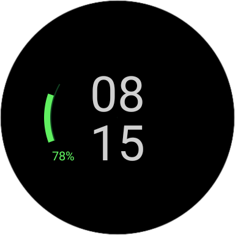

# EcoClock

## WearOS clock app



### Features

- current time display
- battery indicator, with low charge warning
- ambient-aware, for use with always on displays
- update rate dependent on ambient mode

### Packages

|     package     | description                                   |
|:---------------:|:----------------------------------------------|
|  `.components`  | contains view components with rendering logic |
| `.presentation` | Android activity, view & layout classes       |
|       `.`       | abstract base classes: atomic and component   |

### Classes

|       class        | description                                      |
|:------------------:|:-------------------------------------------------|
|     `Atom<V>`      | atomic value, that can be updated and read from  |
|   `Component<V>`   | extension of `Atom`, can be rendered on a canvas |
| `UpdateController` | ambient-aware update dispatcher for atomic views |

### License

```
MIT License

Copyright (c) 2025 Szymon Miękina

Permission is hereby granted, free of charge, to any person obtaining a copy
of this software and associated documentation files (the "Software"), to deal
in the Software without restriction, including without limitation the rights
to use, copy, modify, merge, publish, distribute, sublicense, and/or sell
copies of the Software, and to permit persons to whom the Software is
furnished to do so, subject to the following conditions:

The above copyright notice and this permission notice shall be included in all
copies or substantial portions of the Software.

THE SOFTWARE IS PROVIDED "AS IS", WITHOUT WARRANTY OF ANY KIND, EXPRESS OR
IMPLIED, INCLUDING BUT NOT LIMITED TO THE WARRANTIES OF MERCHANTABILITY,
FITNESS FOR A PARTICULAR PURPOSE AND NONINFRINGEMENT. IN NO EVENT SHALL THE
AUTHORS OR COPYRIGHT HOLDERS BE LIABLE FOR ANY CLAIM, DAMAGES OR OTHER
LIABILITY, WHETHER IN AN ACTION OF CONTRACT, TORT OR OTHERWISE, ARISING FROM,
OUT OF OR IN CONNECTION WITH THE SOFTWARE OR THE USE OR OTHER DEALINGS IN THE
SOFTWARE.
```